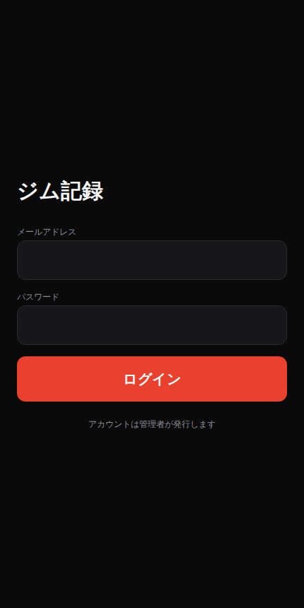

# ジム記録

10人以下のグループで使う、ダークテーマの筋トレ記録PWAです。セット記録、グループフィード、個人履歴、種目ごとの重量推移、メンバー履歴に対応しています。

## 解いた問題

10人以下の少人数グループで筋トレの記録を共有したい。既存の記録アプリは個人利用向け（他人の記録が見えない）か、逆にSNS寄りで通知やタイムラインが重く、少人数の身内利用には過剰。「誰が・いつ・何をやったか」を淡々と共有できるだけの、軽いフィードが欲しかった。

## 設計判断

### なぜ Supabase か

グループ全員が互いの記録を見られるが、自分の記録しか書き換えられない、という権限モデルが要件の中心にある。`supabase/migrations/0002_rls.sql` の Row Level Security ポリシーがこれをそのまま表現している。たとえば `workouts_select` は `to authenticated using (true)`（認証済みなら誰でも閲覧可）だが、`workouts_update_own` は `using (user_id = auth.uid())`（本人のみ更新可）。`workout_sets` はセット自体に `user_id` を持たないため、親 `workouts` の所有者を `exists` で辿って判定している。これをバックエンドを自作して実装する代わりに、DB層のポリシーとして宣言するだけで済ませた。認証（Supabase Auth）とデータアクセス制御が同じ基盤で完結するため、この規模のアプリにサーバーサイドのAPI層を書く理由がなくなる。

### なぜ PWA か

ジムでスマホから使うことを想定しており、ホーム画面に置いて起動できる必要はあるが、10人以下の身内利用でストア審査を通す理由はない。`vite.config.ts` の `VitePWA` 設定は `display: 'standalone'` でアプリらしい見た目にしつつ、`workbox.runtimeCaching: []` かつ `navigateFallbackDenylist: [/^\/api/]` としてAPIレスポンスは一切キャッシュしない（コード中のコメントの通り「古い記録を成功結果として見せない」ため）。プリキャッシュするのはアプリシェル（`globPatterns: ['**/*.{js,css,html,png,svg,woff2}']`）だけで、記録データそのものはオフラインでも古い状態を正として見せない設計にしている。

### なぜ E2E を Playwright で中核導線だけに絞ったか

`tests/e2e/log-workout.spec.ts` は `describe('中核の記録導線', ...)` の中に1テストしかない。ログイン→トレーニング開始→種目検索→セット記録→フィードへの反映→終了、という一本の流れだけを検証している。このアプリの価値は「記録が確実に残ってグループに見えること」に尽きるため、その導線が壊れていないことだけを機械的に担保すればよく、全画面・全操作を網羅するE2Eは費用対効果が合わないと判断した。`E2E_EMAIL`/`E2E_PASSWORD` が未設定なら `test.skip` で自動的にスキップされる（CIでは秘密情報を要求しない）。単体・コンポーネントテストは別途 `npm test`（148件、Vitest）でカバーしている。

## セットアップ

1. `npm install`
2. [Supabaseセットアップ](docs/setup-supabase.md)に従ってプロジェクトとデータベースを準備する
3. `.env.example` を `.env.local` にコピーし、SupabaseのURLとanon keyを記入する
4. `npm run dev`

## コマンド

| コマンド | 内容 |
|---|---|
| `npm run dev` | 開発サーバーを起動 |
| `npm run build` | 型検査と本番ビルド |
| `npm run preview` | 本番ビルドをローカルで確認 |
| `npm test` | ユニット・コンポーネントテスト |
| `npm run test:watch` | テストを監視モードで実行 |
| `npm run test:e2e` | 中核導線のE2Eテスト（Playwright） |

テストを動かすには `.env.test.example` を `.env.test` にコピーし、
テスト用 Supabase プロジェクトの URL と anon key を記入します。

## E2Eテスト

1. Supabaseに動作確認用のアカウントを1つ作る
2. `.env.e2e.example` を `.env.e2e` にコピーし、そのアカウントのメールアドレスとパスワードを記入する
3. `set -a && source .env.e2e && set +a && npm run test:e2e`

`.env.e2e` が無い場合、E2Eテストはスキップされます。

## デプロイ

Vercelに `VITE_SUPABASE_URL` と `VITE_SUPABASE_ANON_KEY` を設定してデプロイします。デプロイ後は、Supabase AuthenticationのSite URLにも公開URLを登録してください。`vercel.json` がSPAの各URLへの直接アクセスを `index.html` にフォールバックします。

## 設計資料

- [設計書](docs/superpowers/specs/2026-08-14-gym-app-design.md)
- [実装計画](docs/superpowers/plans/2026-08-14-gym-app.md)
