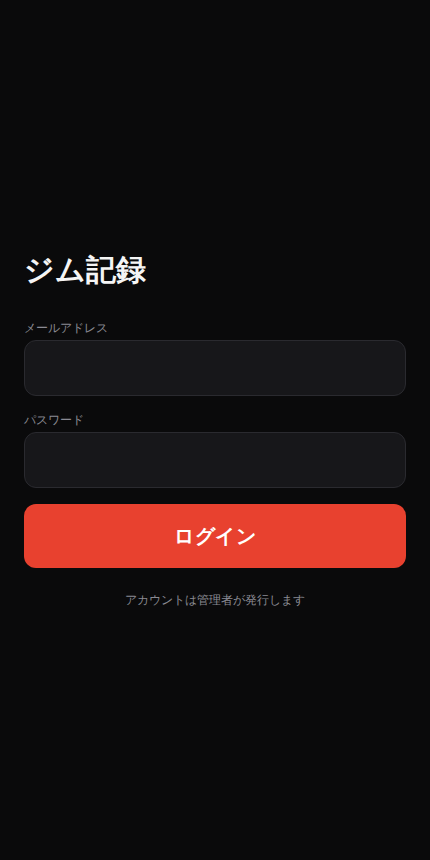

# ジム記録

部位から種目を選び、すぐにセットを記録するダークテーマの筋トレ記録PWAです。画面は「記録・履歴・Big3」の3つ。基本21種目と個人の追加種目、過去日の記録追加、セット・日付の修正、重量推移と目標管理に対応しています。

最新の画面構成・導入手順・検証範囲は[操作のシンプル化](docs/simple-training-flow.md)を参照してください。リリース前に未適用の `0006_personal_exercise_names.sql`、`0007_routines_and_exercise_order.sql` を順に適用してください。

## 解いた問題

ジムに着いたら、フィードや検索を経由せずに記録を始めたい。ホームに部位別の種目を置き、前回の重量・回数を引き継ぐことで、次のセットを1タップで保存できる。間違ったセットや日付は履歴から修正でき、記録し忘れた日も後から追加できる。

## 設計判断

### なぜ Supabase か

グループ全員が互いの記録を見られるが、自分の記録しか書き換えられない、という権限モデルが要件の中心にある。`supabase/migrations/0002_rls.sql` の Row Level Security ポリシーがこれをそのまま表現している。たとえば `workouts_select` は `to authenticated using (true)`（認証済みなら誰でも閲覧可）だが、`workouts_update_own` は `using (user_id = auth.uid())`（本人のみ更新可）。`workout_sets` はセット自体に `user_id` を持たないため、親 `workouts` の所有者を `exists` で辿って判定している。これをバックエンドを自作して実装する代わりに、DB層のポリシーとして宣言するだけで済ませた。認証（Supabase Auth）とデータアクセス制御が同じ基盤で完結するため、この規模のアプリにサーバーサイドのAPI層を書く理由がなくなる。

### なぜ PWA か

ジムでスマホから使うことを想定しており、ホーム画面に置いて起動できる必要はあるが、10人以下の身内利用でストア審査を通す理由はない。`vite.config.ts` の `VitePWA` 設定は `display: 'standalone'` でアプリらしい見た目にしつつ、`workbox.runtimeCaching: []` かつ `navigateFallbackDenylist: [/^\/api/]` としてAPIレスポンスは一切キャッシュしない（コード中のコメントの通り「古い記録を成功結果として見せない」ため）。プリキャッシュするのはアプリシェル（`globPatterns: ['**/*.{js,css,html,png,svg,woff2}']`）だけで、記録データそのものはオフラインでも古い状態を正として見せない設計にしている。

### 操作の検証

`npm run test:e2e:mock` は認証情報を必要とせず、スマホ幅で記録・過去日の追加・編集・削除・個人種目の追加を検証する。CIでも実行する。実Supabaseへの接続確認は `npm run test:e2e` で別途行い、`E2E_EMAIL`/`E2E_PASSWORD` が未設定ならスキップする。単体・コンポーネントテストは `npm test` で実行する。

## セットアップ

1. `npm install`
2. [Supabaseセットアップ](docs/setup-supabase.md)に従ってプロジェクトとデータベースを準備する
3. `.env.example` を `.env.local` にコピーし、SupabaseのURLとanon keyを記入する
4. `npm run dev`

## コマンド

| コマンド | 内容 |
|---|---|
| `npm run dev` | 開発サーバーを起動 |
| `npm run build` | 型検査と本番ビルド |
| `npm run preview` | 本番ビルドをローカルで確認 |
| `npm test` | ユニット・コンポーネントテスト |
| `npm run test:watch` | テストを監視モードで実行 |
| `npm run test:e2e` | 中核導線のE2Eテスト（Playwright） |
| `npm run test:e2e:mock` | モックAPIで記録・編集・部位別追加を確認 |

テストを動かすには `.env.test.example` を `.env.test` にコピーし、
テスト用 Supabase プロジェクトの URL と anon key を記入します。

## E2Eテスト

1. Supabaseに動作確認用のアカウントを1つ作る
2. `.env.e2e.example` を `.env.e2e` にコピーし、そのアカウントのメールアドレスとパスワードを記入する
3. `set -a && source .env.e2e && set +a && npm run test:e2e`

`.env.e2e` が無い場合、E2Eテストはスキップされます。

## デプロイ

Vercelに `VITE_SUPABASE_URL` と `VITE_SUPABASE_ANON_KEY` を設定してデプロイします。デプロイ後は、Supabase AuthenticationのSite URLにも公開URLを登録してください。`vercel.json` がSPAの各URLへの直接アクセスを `index.html` にフォールバックします。

## 設計資料

- [設計書](docs/superpowers/specs/2026-08-14-gym-app-design.md)
- [実装計画](docs/superpowers/plans/2026-08-14-gym-app.md)
